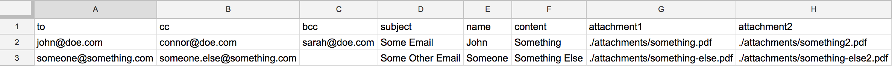

# mail-unmerge

A tool to shoot out individual emails to a huge group with unique attachments configuration with a CSV

## How to install?

You need to have Node.js installed on your system before you can use this package. Get it here: [Node.js](https://nodejs.org/)

Once you have Node.js and NPM setup, you can run:

    sudo npm install -g mail-unmerge

Or the following in your admin command prompt on Windows:

    npm install -g mail-unmerge

## How to use?

### Make a CSV in the following format:

The `email` and `subject` field compulsory, rest all are custom fields and can be replaced with one of your own. The `attachment` fields are obviously optional.

### Compose your email template like:

    Hi <name>,

    Here you go: <content>

    Regards,
    HR Team.

You can even use HTML to format your content template.

### Let mail unmerge take control!

    mail-unmerge ./header.csv ./content-template.txt

It will send out individual emails to all the emails listed in the CSV.
